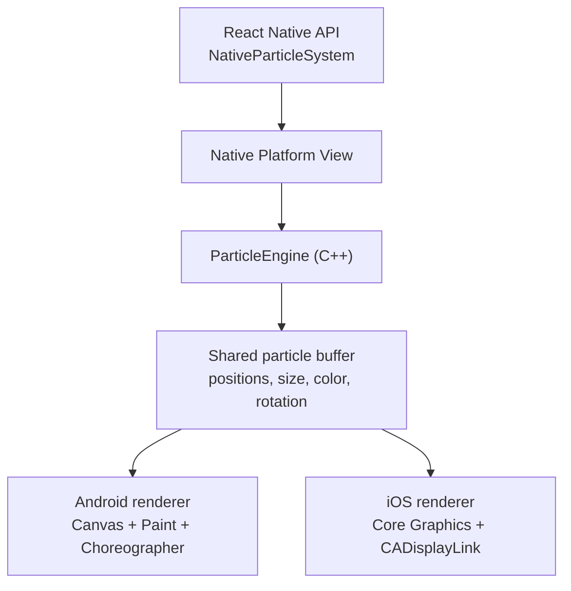

# react-native-particle

A high-performance particle engine for React Native, built with [Nitro Modules](https://github.com/mrousavy/nitro). Simulates thousands of particles entirely in C++ — no JS thread involvement on the render path.

[](https://www.npmjs.com/package/react-native-particle)
[](https://www.npmjs.com/package/react-native-particle)
[](https://github.com/jonpena/react-native-particle/LICENSE)

## Requirements

- React Native 0.78.0 or higher (Nitro Views require Fabric)
- Node 18.0.0 or higher

## Installation

```bash
npm install react-native-particle react-native-nitro-modules
```

## Renderer

`NativeParticleSystem` uses Android Canvas / iOS Core Graphics and keeps the render path fully native with zero JS thread involvement.

## Architecture



The simulation runs in C++. Each platform advances the engine natively, reads the particle buffer directly, and draws with its own native canvas. No per-frame particle data goes through the JS thread.

## Usage

### NativeParticleSystem

```tsx
import { NativeParticleSystem } from 'react-native-particle'

<NativeParticleSystem
  preset="fire"
  count={400}
  x={200}
  y={600}
  loop
  emitInterval={200}
/>
```

## Presets

`confetti` · `fire` · `explosion`

## Credits

Bootstrapped with [create-nitro-module](https://github.com/patrickkabwe/create-nitro-module).

## Contributing

Pull requests are welcome. For major changes, please open an issue first.
