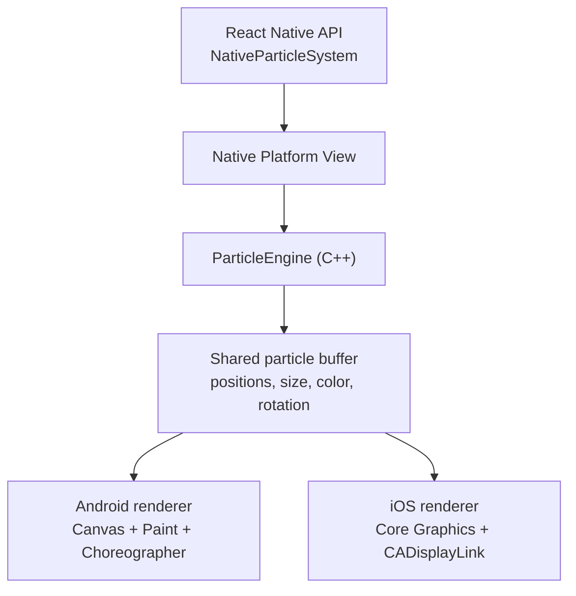

# react-native-particle

A high-performance particle engine for React Native, built with [Nitro Modules](https://github.com/mrousavy/nitro). Simulates thousands of particles entirely in C++ — no JS thread involvement on the render path.

[](https://www.npmjs.com/package/react-native-particle)
[](https://www.npmjs.com/package/react-native-particle)
[](https://github.com/jonpena/react-native-particle/LICENSE)

## Requirements

- React Native 0.78.0 or higher (Nitro Views require Fabric)
- Node 18.0.0 or higher

## Installation

```bash
npm install react-native-particle react-native-nitro-modules
```

## Renderer

`NativeParticleSystem` uses Android Canvas / iOS Core Graphics and keeps the render path fully native with zero JS thread involvement.

## Architecture



The simulation runs in C++. Each platform advances the engine natively, reads the particle buffer directly, and draws with its own native canvas. No per-frame particle data goes through the JS thread.

## Usage

### NativeParticleSystem

```tsx
import { NativeParticleSystem } from 'react-native-particle'
import type { PresetConfig } from 'react-native-particle'

const fire: PresetConfig = {
  velocityX: [-34, 34],
  velocityY: [-180, -70],
  accelerationY: -8,
  dampingVelocity: 0.972,
  sizeStart: 22,
  sizeEnd: 0,
  sizeEase: 'easeOut',
  lifetimeMin: 1.0,
  lifetimeMax: 2.1,
  colorStart: [0.08, 0.03, 0.0, 1.0],
  colorMid: [1.0, 0.36, 0.02, 1.0],
  colorMidPoint: 0.34,
  colorEnd: [1.0, 0.95, 0.28, 0.0],
  alphaStart: 0.0,
  alphaEnd: 1.0,
  alphaEase: 'pulse',
  blendMode: 'additive',
  emitRadius: 14,
}

<NativeParticleSystem
  preset={fire}
  count={400}
  x={200}
  y={600}
  layer="foreground"
  loop
  emitInterval={200}
/>
```

`layer` controls the default stacking order:

- `background` draws behind sibling UI
- `foreground` draws in front of sibling UI

You can also pass `style` for advanced host-view overrides. If `style` includes a `zIndex`, it overrides the default provided by `layer`.

## PresetConfig

`PresetConfig` controls how particles spawn, move, evolve, and blend. Pass a plain object; the adapter serializes it to native JSON for you.

### Motion

- `velocityX`, `velocityY`: min/max spawn velocity in logical px/s
- `accelerationX`, `accelerationY`: constant acceleration
- `turbulenceX`, `turbulenceY`: per-frame random force for more organic motion
- `dampingVelocity`: drag multiplier applied each frame
- `lifetimeMin`, `lifetimeMax`: particle lifetime range in seconds

### Size

- `sizeStart`, `sizeEnd`: size over lifetime
- `sizeEase`: `linear | easeIn | easeOut | pulse`

### Color and Alpha

- `colorStart`, `colorEnd`: RGBA color track
- `colorMid`, `colorMidPoint`: optional 3-stop color gradient
- `alphaStart`, `alphaEnd`, `alphaEase`: optional independent alpha track
- `randomColor`: random hue per particle
- `blendMode`: `normal | additive`

### Emission

- `emitShape`: `point | circle | ring | line`
- `emitRadius`: radius for `circle` and `ring`
- `emitWidth`, `emitHeight`: dimensions for `line`

### Particle Shape

- `shape`: `circle | rect | line`
- `rotationMin`, `rotationMax`: initial angle in degrees
- `spinMin`, `spinMax`: angular velocity in degrees/s

## Examples

### Soft smoke with turbulence

```tsx
const smoke: PresetConfig = {
  velocityX: [-18, 18],
  velocityY: [-55, -18],
  accelerationY: -3,
  turbulenceX: 22,
  turbulenceY: 12,
  dampingVelocity: 0.989,
  sizeStart: 18,
  sizeEnd: 56,
  lifetimeMin: 3.0,
  lifetimeMax: 5.2,
  colorStart: [0.48, 0.5, 0.54, 0.32],
  colorEnd: [0.76, 0.78, 0.82, 0.0],
  emitRadius: 10,
}
```

### Snow from a line emitter

```tsx
const snow: PresetConfig = {
  velocityX: [-22, 22],
  velocityY: [18, 48],
  accelerationY: 4,
  turbulenceX: 10,
  dampingVelocity: 0.998,
  sizeStart: 6,
  sizeEnd: 4,
  lifetimeMin: 5.5,
  lifetimeMax: 8.5,
  colorStart: [0.96, 0.98, 1.0, 0.9],
  colorEnd: [0.96, 0.98, 1.0, 0.0],
  emitShape: 'line',
  emitWidth: 120,
  emitHeight: 20,
}
```

### Sparkles with additive blending

```tsx
const sparkles: PresetConfig = {
  velocityX: [-110, 110],
  velocityY: [-110, 110],
  accelerationY: 40,
  dampingVelocity: 0.92,
  sizeStart: 5,
  sizeEnd: 0,
  sizeEase: 'easeOut',
  lifetimeMin: 0.18,
  lifetimeMax: 0.45,
  alphaStart: 0.0,
  alphaEnd: 1.0,
  alphaEase: 'pulse',
  randomColor: true,
  blendMode: 'additive',
  emitRadius: 12,
}
```

### Foreground confetti

```tsx
const confetti: PresetConfig = {
  velocityX: [-180, 180],
  velocityY: [-260, -120],
  accelerationY: 240,
  turbulenceX: 24,
  dampingVelocity: 0.985,
  sizeStart: 9,
  sizeEnd: 7,
  sizeEase: 'pulse',
  lifetimeMin: 1.8,
  lifetimeMax: 2.8,
  randomColor: true,
  shape: 'rect',
  rotationMin: -180,
  rotationMax: 180,
  spinMin: -540,
  spinMax: 540,
  emitShape: 'line',
  emitWidth: 80,
  emitHeight: 10,
}

<NativeParticleSystem
  preset={confetti}
  count={22}
  x={180}
  y={620}
  layer="foreground"
  loop
  emitInterval={520}
/>
```

## Notes

- `x` and `y` are logical coordinates in the React Native layout space.
- If `emitRadius` is provided without `emitShape`, it is treated as a `circle` emitter for backward compatibility.
- `blendMode: 'additive'` is especially useful for fire, sparkles, magic, and electric effects.

## Presets

`confetti` · `fire` · `explosion`

## Credits

Bootstrapped with [create-nitro-module](https://github.com/patrickkabwe/create-nitro-module).

## Contributing

Pull requests are welcome. For major changes, please open an issue first.
