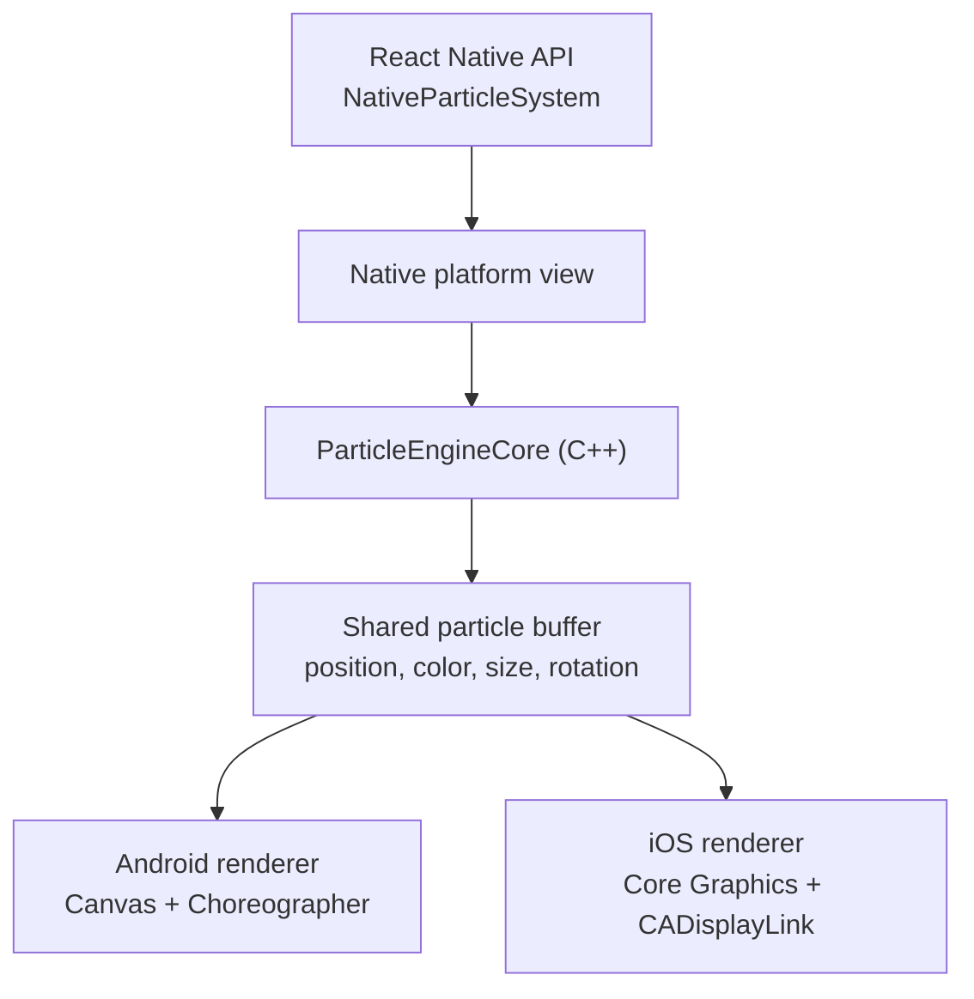

# react-native-particle

Native 2D particles for React Native with a simple preset-driven API, C++ simulation, and zero JS thread work on the render path.

> **Platform support:** Android and iOS

## Why this library

- Native render path with Android Canvas and iOS Core Graphics
- C++ simulation with preallocated buffers
- No per-frame particle work on the JS thread
- Preset-driven API that is easy to drop into React screens
- Supports thousands of particles without sending frame data through JS
- Built on Nitro Modules and Fabric-compatible React Native views
- Useful for fire, smoke, sparkles, snow, confetti, and similar FX

## When to use each API

| API | Use it when |
| --- | --- |
| `NativeParticleSystem` | You want to render a particle effect directly in a React Native screen |
| `PresetConfig` | You want to define how particles spawn, move, change size, change color, and blend |
| `layer="background"` | The effect should render behind sibling UI |
| `layer="foreground"` | The effect should render above sibling UI |

If you are building UI in React, start with `NativeParticleSystem`.

## Installation

### React Native (bare)

```sh
npm install react-native-particle react-native-nitro-modules
```

Then for iOS:

```sh
cd ios && pod install
```

## Requirements

- React Native `0.78.0` or higher
- Fabric enabled
- Node `18+`

## Quick start

This is the shortest useful flow for most apps:

1. Define a `PresetConfig`
2. Render `NativeParticleSystem`
3. Tune `count`, position, and `emitInterval`

```tsx
import { View } from 'react-native'
import { NativeParticleSystem } from 'react-native-particle'
import type { PresetConfig } from 'react-native-particle'

const fire: PresetConfig = {
  velocityX: [-34, 34],
  velocityY: [-180, -70],
  accelerationY: -8,
  dampingVelocity: 0.972,
  sizeStart: 22,
  sizeEnd: 0,
  sizeEase: 'easeOut',
  lifetimeMin: 1.0,
  lifetimeMax: 2.1,
  colorStart: [0.08, 0.03, 0.0, 1.0],
  colorMid: [1.0, 0.36, 0.02, 1.0],
  colorMidPoint: 0.34,
  colorEnd: [1.0, 0.95, 0.28, 0.0],
  alphaStart: 0.0,
  alphaEnd: 1.0,
  alphaEase: 'pulse',
  blendMode: 'additive',
  emitRadius: 14,
}

export const FireDemo = () => {
  return (
    <View style={{ flex: 1 }}>
      <NativeParticleSystem
        preset={fire}
        count={400}
        x={200}
        y={600}
        layer="foreground"
        loop
        emitInterval={200}
      />
    </View>
  )
}
```

This shows the smallest useful flow. In a real app, you will usually centralize
your effect presets and reuse them across screens.

## Recommended app-level usage

For apps with multiple screens or repeated effects, define presets once and
reuse them instead of building config objects inline everywhere.

```tsx
import type { PresetConfig } from 'react-native-particle'

export const smokePreset: PresetConfig = {
  velocityX: [-18, 18],
  velocityY: [-55, -18],
  accelerationY: -3,
  turbulenceX: 22,
  turbulenceY: 12,
  dampingVelocity: 0.989,
  sizeStart: 18,
  sizeEnd: 56,
  lifetimeMin: 3.0,
  lifetimeMax: 5.2,
  colorStart: [0.48, 0.5, 0.54, 0.32],
  colorEnd: [0.76, 0.78, 0.82, 0.0],
  emitRadius: 10,
}
```

Then screens can focus on layout and timing:

```tsx
<NativeParticleSystem
  preset={smokePreset}
  count={20}
  x={160}
  y={420}
  loop
  emitInterval={420}
/>
```

For a fuller working example, see the `example/` app in this repository:
[react-native-particle example](https://github.com/jonpena/react-native-particle/tree/main/example)

## API summary

### `NativeParticleSystem`

Use this component when you want a particle effect rendered natively inside a
React Native screen.

Props:

- `preset`: required `PresetConfig`
- `count?`: particles emitted per burst
- `x?`, `y?`: emitter position in logical layout coordinates
- `loop?`: whether the emitter should keep emitting
- `emitInterval?`: interval between bursts in milliseconds
- `layer?`: `'background' | 'foreground'`
- `style?`: host view override for layout, opacity, or z-order

Notes:

- `x = 0` and `y = 0` are treated by native as “center me” for fullscreen effects
- `style.zIndex` overrides the default z-order implied by `layer`
- the host view uses `StyleSheet.absoluteFill`, so make sure the parent has layout

### `PresetConfig`

Use `PresetConfig` to define how particles spawn, move, evolve, and blend.

#### Motion

- `velocityX`, `velocityY`: min/max spawn velocity in logical px/s
- `accelerationX`, `accelerationY`: constant acceleration
- `turbulenceX`, `turbulenceY`: per-frame random force for more organic motion
- `dampingVelocity`: drag multiplier applied each frame
- `lifetimeMin`, `lifetimeMax`: particle lifetime range in seconds

#### Size

- `sizeStart`, `sizeEnd`: size over lifetime
- `sizeEase`: `linear | easeIn | easeOut | pulse`

#### Color and alpha

- `colorStart`, `colorEnd`: RGBA color track
- `colorMid`, `colorMidPoint`: optional 3-stop gradient
- `alphaStart`, `alphaEnd`, `alphaEase`: optional independent alpha track
- `randomColor`: random hue per particle
- `blendMode`: `normal | additive`

#### Emission

- `emitShape`: `point | circle | ring | line`
- `emitRadius`: radius for `circle` and `ring`
- `emitWidth`, `emitHeight`: dimensions for `line`

#### Particle shape

- `shape`: `circle | rect | line`
- `rotationMin`, `rotationMax`: initial angle in degrees
- `spinMin`, `spinMax`: angular velocity in degrees/s

## Effect recipes

### Soft smoke

```tsx
const smoke: PresetConfig = {
  velocityX: [-18, 18],
  velocityY: [-55, -18],
  accelerationY: -3,
  turbulenceX: 22,
  turbulenceY: 12,
  dampingVelocity: 0.989,
  sizeStart: 18,
  sizeEnd: 56,
  lifetimeMin: 3.0,
  lifetimeMax: 5.2,
  colorStart: [0.48, 0.5, 0.54, 0.32],
  colorEnd: [0.76, 0.78, 0.82, 0.0],
  emitRadius: 10,
}
```

### Snow from a line emitter

```tsx
const snow: PresetConfig = {
  velocityX: [-22, 22],
  velocityY: [18, 48],
  accelerationY: 4,
  turbulenceX: 10,
  dampingVelocity: 0.998,
  sizeStart: 6,
  sizeEnd: 4,
  lifetimeMin: 5.5,
  lifetimeMax: 8.5,
  colorStart: [0.96, 0.98, 1.0, 0.9],
  colorEnd: [0.96, 0.98, 1.0, 0.0],
  emitShape: 'line',
  emitWidth: 120,
  emitHeight: 20,
}
```

### Sparkles

```tsx
const sparkles: PresetConfig = {
  velocityX: [-110, 110],
  velocityY: [-110, 110],
  accelerationY: 40,
  dampingVelocity: 0.92,
  sizeStart: 5,
  sizeEnd: 0,
  sizeEase: 'easeOut',
  lifetimeMin: 0.18,
  lifetimeMax: 0.45,
  alphaStart: 0.0,
  alphaEnd: 1.0,
  alphaEase: 'pulse',
  randomColor: true,
  blendMode: 'additive',
  emitRadius: 12,
}
```

### Foreground confetti

```tsx
const confetti: PresetConfig = {
  velocityX: [-180, 180],
  velocityY: [-260, -120],
  accelerationY: 240,
  turbulenceX: 24,
  dampingVelocity: 0.985,
  sizeStart: 9,
  sizeEnd: 7,
  sizeEase: 'pulse',
  lifetimeMin: 1.8,
  lifetimeMax: 2.8,
  randomColor: true,
  shape: 'rect',
  rotationMin: -180,
  rotationMax: 180,
  spinMin: -540,
  spinMax: 540,
  emitShape: 'line',
  emitWidth: 80,
  emitHeight: 10,
}
```

## Platform behavior and limits

### Android

- rendering uses `Canvas`, `Paint`, and `Choreographer`
- simulation and draw cadence stay on the native side
- additive blending is supported

### iOS

- rendering uses `Core Graphics` and `CADisplayLink`
- simulation and draw cadence stay on the native side
- additive blending is supported

### Current limits

- this is a 2D particle engine
- particles are currently rendered as `circle`, `rect`, or `line`
- there is no sprite or texture particle support yet
- the engine is optimized for preset-driven FX, not arbitrary shader-based visuals

## Architecture



The simulation runs in C++. Each platform steps the engine natively, reads the
particle buffer directly, and draws using its own renderer. No per-frame
particle data is sent through the JS thread.

## Roadmap highlights

Upcoming priorities in [ROADMAP.md](/Users/jonathan/Desktop/react-native-particle/ROADMAP.md):

- imperative ref API
- chained emitters and child bursts
- sprite or image particles
- expanded per-particle variation
- simple force fields
- preset validation and diagnostics

## Troubleshooting

### Nothing renders

Check the basics first:

- Fabric is enabled
- the parent view has size
- the emitter coordinates are inside the visible area
- `preset` contains valid ranges and values

### The effect is behind or in front of the wrong UI

Use `layer="background"` or `layer="foreground"`. If you need tighter control,
pass `style={{ zIndex: ... }}`.

### The motion feels too linear

Increase `turbulenceX` / `turbulenceY`, add drag with `dampingVelocity`, and
use non-linear curves such as `sizeEase: 'easeOut'` or `alphaEase: 'pulse'`.

## License

MIT
